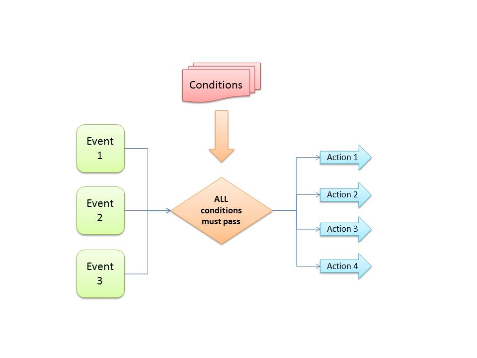

----------
## Overview ##

This tutorial provides an overview of the internal Javascript architecture of MagicasterJS. Diagrams and descriptions try to illustrate the fundamental structure of the framework.

## MCMagicast structure ##

MCMagicast (window.Magicast) is the top level singleton instance of the framework providing the public API. MCMagicast is responsible for analysing the current web page, finding Magicast containers and constructing Magicast object instances.

Other responsibilities include collision detection (due to being cross-Magicast), key event handling and mapping (e.g. for HBBTV use cases) and capability management.

Capability management is used to analyze the capabilities of the running platform. Magicast objects can have requirements in their Magicst data. For example they can require camera features to exist. Capability management resolves the different capabilities and analyzes whether the Magicast object is supported in the current running platform. In the failing case MCMagicast fires global event.

## MCObject structure ##

Magicast object (MCObject) is the heart of the framework. Each MCObject represents one Magicast object. Magicast elements in the web page can be very flexible, so they can be fixed size, variable size, fullscreen or event hidden elements.

The basic building blocks of the Magicast objects are nodes, layers and triggers. There needs to be at least one node defined in the Magicast data to make it work. Nodes represent the state of the Magicast object, so node change is actually a change from one state to another. MCNode represents the state.

Layer can be thought as UI element such as image, video or text. However layer does not need to have actual physical element (or component instance), so it can be fully abstract. The normal case though is to have one component asset per layer. MCLayer is the JavaScript abstraction of layer and layer hierarchy is described more closely in the next chapter.

Trigger provides the support for interactions. Triggers tie events to actions under certain conditions. 

## Layer structure ##

Layer in MagicasterJS is the closest presentation of UI element. There's one MCLayer instance for each layer definition. Layers normally are node-specific, but they can live over node change, if defined.

MCLayer resolves the component asset using Magicast configuration's asset resolvers. Then MCLayer uses RequireJS to load the required component asynchronously. Deferred design pattern is used throughout the framework to handle asynchronisity. 

MCLayer is also responsible for validating the possible component requirements. If component requires such features that are not available in the running platform, the component is destroyed and in the non-production mode a placeholder is shown instead.

## Triggers, events and conditions

Triggers provide the interaction possibility between user and the Magicast object, and also between two or more individual Magicast objects. Triggers are made of events, conditions and actions. Following diagram illustrates the relations between these concepts. A couple of things to note from the diagram:

- Any event can start the action. This means that one trigger can listen to any number of events and it's enough that one event is detected.
- Immediate trigger might not have any events defined. Instead it is triggered when the specific node has been started.
- Trigger can have 0 or more conditions. Conditions are evaluated with AND operator, meaning all conditions must pass in order to execute the actions.
- All actions are executed every time. Fail in one action should not prevent other actions to be executed.
- Order of actions in Magicast definition is relevant. Triggers and therefore actions are run in the specified order.  

Actions can be node-specific or layer-specific. Node-specific actions are resolved to specific resolver functions, but layer-specific actions are triggered as DOM event to the layer content. Unknown actions are converted into DOM-events, allowing Magicast objects to call actions defined in page's JavaScript.

MagicasterJS contains support for object to object -eventing. This means that one trigger defined in Magicast object A can listen to events from Magicast object B and execute appropriate actions on Magicast object C. 